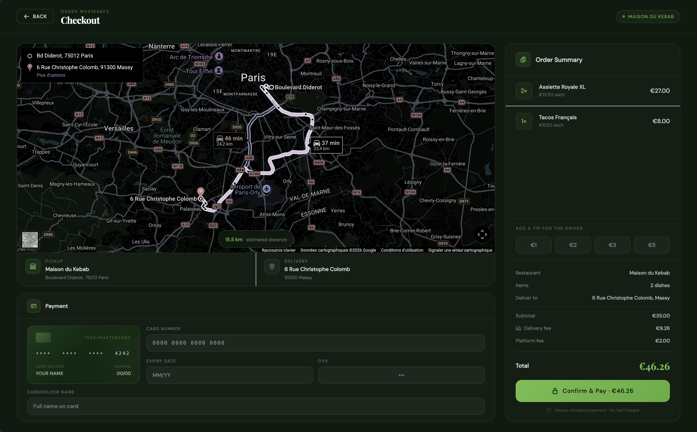
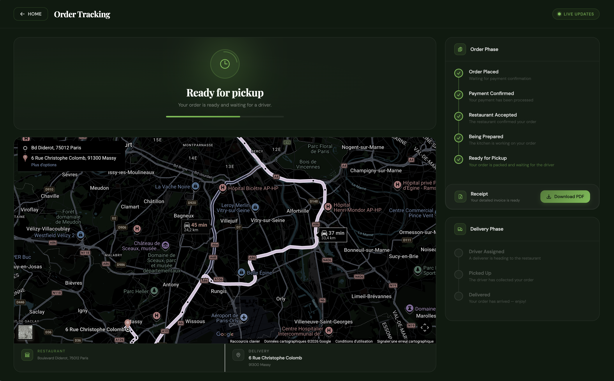

# 5ESGI-IW EcoEats -Frontend Angular: 

> Interface web de la plateforme EcoEats - Clients, Restaurateurs & Livreurs


## Description
Ce repository contient le frontend web de la plateforme EcoEats, développé en Angular. Il consomme l'API backend et couvre les trois portails utilisateurs :

- Client: Parcourir les restaurants, constituer un panier, passer et suivre une commande
- Restaurateur: Gérer son menu, recevoir et traiter les commandes
- Livreur: Gérer sa disponibilité, accepter des livraisons, suivre ses revenus

Chaque portail est isolé dans son propre module avec son shell dédié, accessible après authentification.

##  Stack Technique

| Technologie | Rôle |
|---|---|
| **Angular** | Framework frontend |
| **TypeScript** | Langage |
| **TailwindCSS** | Styling utilitaire |
| **RxJS** | Gestion réactive des données |

## Structure du Projet:

```
src/
├── app/
│   ├── core/                   # Services et logique core de l'application
│   │   ├── auth/               # Service d'authentification, tokens
│   │   ├── guards/             # Guards de routes (rôles, auth)
│   │   ├── http/               # Client HTTP, configuration API
│   │   ├── interceptors/       # Intercepteurs (auth headers, erreurs)
│   │   ├── types/              # Types et interfaces partagés
│   │   └── utils/              # Fonctions utilitaires (observables, state management)
│   │
│   ├── features/               # Modules fonctionnels
│   │   ├── login/              # connexion 
│   │   ├── portal/             # Portails par rôle (chacun avec son shell)
│   │   │   ├── client/         # Module client (menus, panier, commandes ...)
│   │   │   ├── restaurant/     # Module restaurateur (menu, commandes ...)
│   │   │   └── deliverer/      # Module livreur (livraisons, revenus ...)
│   │   └── signup/             # inscription
│   │
│   ├── shared/                 # Composants et services réutilisables
│   │   ├── components/         # Composants UI partagés
│   │   ├── dialogs/            # Modales et dialogues
│   │   ├── pipes/              # Pipes Angular personnalisés
│   │   ├── services/           # Services partagés
│   │   └── types/              # Types communs
│   │
│   ├── app.html
│   ├── app.config.ts
│   ├── app.routes.ts
│   └── app.ts
│
├── environments/
│   └── environment.ts          # Configuration par environnement (URL API, etc.)
│
├── styles.css                  # Styles globaux + TailwindCSS
├── index.html
└── main.ts
```


## Quick start: 
### Prérequis

- **Node.js** ≥ 22
- **Angular CLI** installé globalement (`npm install -g @angular/cli`)
- Le backend EcoEats doit tourner (voir [ecoeats-backend](https://github.com/clean_architecture-5ESGI/ecoeats-backend))

### Installation

```bash
# Cloner le repository
git clone https://github.com/clean_architecture-5ESGI/ecoeats-frontend-angular.git
cd ecoeats-frontend
 
# Installer les dépendances
npm install
```

### Configuration

Modifier le fichier `src/environments/environment.ts` pour pointer vers votre API backend :

```typescript
export const environment = {
  apiUrl: 'http://localhost:3000', // remplacer par l'url de votre backend
};
```

### Lancement

```bash
# Démarrer en mode développement
ng serve
 
# Accessible sur http://localhost:4200
```

## Screenshot:


--- 





